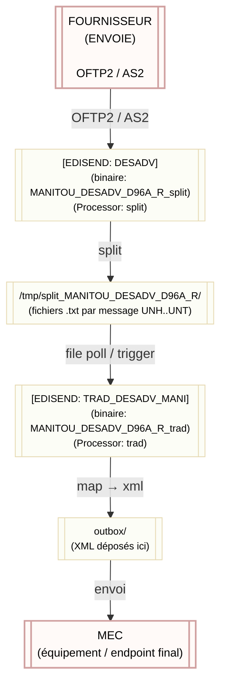

# MANITOU DESADV D96A R — README explicatif

Ce document explique les changements apportés : séparation du RTE original en deux composants (splitter + traducteur), où les fichiers doivent être placés et comment installer / basculer en production.

## Résumé
- Nous avons extrait la partie « split » du RTE original `MANITOU_DESADV_D96A_R.rte` en un RTE dédié : `MANITOU_DESADV_D96A_R_split.rte` (ou `MANITOU_DESADV_D96A_R.split.rte` selon nommage).
- Le traducteur original a été adapté en un RTE « trad » appelé `MANITOU_DESADV_D96A_R_trad.rte` qui lit les fichiers splittés et produit les XML dans `outbox/`.

Avant : un seul RTE prenait en entrée l'interchange EDIFACT et faisait le split + la traduction.
Maintenant : pipeline en deux étapes — split (un fichier par message UNH..UNT) → trad (mapping → XML).

## Schéma du flux



> Remarque : le bloc "FOURNISSEUR" est le point d'entrée (OFTP2 / AS2), et le bloc "MEC" est l'endpoint final auquel les XML sont destinés.

## Que fait chaque composant ?

- FOURNISSEUR : envoie un fichier EDIFACT (interchange). Le transport peut être OFTP2, AS2 ou équivalent.
- EDISEND DESADV (split) : lit l'interchange, découpe chaque message UNH..UNT et écrit un fichier par message dans `/tmp/split_MANITOU_DESADV_D96A_R/`.
- Répertoire de split : contient les fichiers individuels (extension `.edi` ou `.txt`) prêts pour la traduction.
- EDISEND TRAD_DESADV_MANI (trad) : consomme les fichiers splittés, applique le mapping et produit les fichiers XML dans `outbox/`.
- OUTBOX / MEC : fichiers XML stockés en `outbox/` puis envoyés/consommés par le système de destination (MEC).

## Installation / bascule (script fourni)

Le script suivant archive l'ancien RTE `MANITOU_DESADV_D96A_R.rte` en lui ajoutant `_old`, copie les nouveaux RTEs, compile et prépare les dossiers nécessaires.

Fichiers fournis :

- `install_manitou_update.sh` — script d'installation (archive et installe). Exécuter dans le répertoire `package_install_rte_20251027/`.
- `rollback_manitou_update.sh` — helper fourni pour effectuer un rollback simple (supprime les RTE installés et restaure la dernière archive depuis `edidev/rte/ARCHIVE/`).
  
Note importante : l'installateur ne génère plus de script de rollback par installation. Lorsqu'il archive les anciens RTEs, il les place dans `edidev/rte/ARCHIVE/`. Utilisez le helper `rollback_manitou_update_20251027.sh` fourni dans le paquet pour supprimer les RTE installés (split + trad) et restaurer automatiquement la dernière archive disponible (le helper remettra l'archive au nom `MANITOU_DESADV_D96A_R.rte`).


### Notes pour la mise en place du routage

- Remplacer l'ancien edisend qui traitait tout en un par deux edisends :
  - Un edisend (ou le même edisend configuré) doit lancer `MANITOU_DESADV_D96A_R_split` lors de la réception (OFTP2/AS2) et écrire les messages splittés dans `/inbox/split_MANITOU_DESADV_D96A_R/`.
  - Un second edisend (TRAD) doit surveiller ce répertoire (mode as-file polling ou par trigger) et lancer `MANITOU_DESADV_D96A_R_trad` pour produire les XML.

- Si votre plateforme utilise une configuration de réception (recevin / route), ajoutez/modifiez l'entrée pour diriger les paquets entrants vers le RTE split. Exemple conceptuel :

  - Rechercher où est défini `MANITOU_DESADV_D96A_R.rte` dans vos configurations `rte/` ou dans l'interface d'administration d'EDISEND et remplacer par `MANITOU_DESADV_D96A_R_split` pour l'étape d'arrivée.

## Vérifications post-installation

1. Placer manuellement un fichier EDIFACT de test dans `inbox/edifact/` et vérifier que le répertoire `inbox/split_MANITOU_DESADV_D96A_R/` reçoit un fichier par message UNH..UNT.
2. Vérifier que `outbox/` reçoit les fichiers XML générés par le traducteur.
3. Consulter `syslog` / logs applicatifs pour s'assurer qu'il n'y a pas d'erreurs de parsing ou d'encoding.

## Arborescence et emplacements utiles

Exemple attendu (structure racine `edidev/`) :

```
edidev/
├── rte/
│   ├── MANITOU_DESADV_D96A_R_20251027_old.rte (ancien)
│   ├── MANITOU_DESADV_D96A_R_split.rte (nouveau)
│   ├── MANITOU_DESADV_D96A_R.rte (nouveau)
├── inbox/
│   ├── edifact/
│   └── split_MANITOU_DESADV_D96A_R/
└── outbox/
└── package_install_rte_20251027/
```

Fin du README.

## Commandes bash (install / rollback)

Exemples rapides pour exécuter l'installation et faire un rollback. Adaptez les chemins selon votre installation.

1) Installer depuis le paquet (exécuter dans le dossier du paquet `package_install_rte_20251027`)

```bash
# placez les fichiers fournis dans le dossier du paquet (ou utilisez ceux fournis)
cd /chemin/vers/edidev/package_install_rte_20251027
./install_manitou_update_20251027.sh
```

2) Si vous voulez lancer l'install sans changer de dossier (exécution depuis n'importe où)

```bash
./chemin/vers/edidev/package_install_rte_20251027/install_manitou_update_20251027.sh
```

3) Lister les archives disponibles (dans `edidev/rte/ARCHIVE/` — c'est ici que l'installateur place les archives)

```bash
ls -1 /chemin/vers/edidev/rte/ARCHIVE/ | grep MANITOU_DESADV_D96A_R || true
```

4) Utiliser le helper fourni pour effectuer le rollback (supprime les RTE installés et restaure la dernière archive)

```bash
cd /chemin/vers/edidev/package_install_rte_20251027
./rollback_manitou_update_20251027.sh
```
