# MANITOU DESADV D96A R 
## Schéma du flux

```mermaid
flowchart LR
  %% Styles (paler backgrounds, black text)
  classDef inboxStyle fill:#fff7f7,stroke:#c85b5b,stroke-width:1px,color:#000;
  classDef splitStyle fill:#fffdf0,stroke:#d6a85a,stroke-width:1px,color:#000;
  classDef tradStyle fill:#f6fff5,stroke:#6aa86a,stroke-width:1px,color:#000;
  classDef outStyle fill:#f2f7ff,stroke:#5a9be0,stroke-width:1px,color:#000;
  %% Font-size definition (use single class application)
  classDef smallFont font-size:12px;

  %% Nodes (apply one class per node, then assign smallFont separately)
  inbox[["inbox/edifact/ <-- Fournisseur dépose ici"]]
  class inbox inboxStyle
  class inbox smallFont

  edisend_split[["[EDISEND: DESADV]  (binaire: MANITOU_DESADV_D96A_R)  <- processeur initial"]]
  class edisend_split splitStyle
  class edisend_split smallFont

  split_dir[["/tmp/split_MANITOU_DESADV_D96A_R/   <-- fichiers .txt créés par le splitter"]]
  class split_dir splitStyle
  class split_dir smallFont

  edisend_trad[["[EDISEND: TRAD_DESADV_MANI] (binaire: MANITOU_DESADV_D96A_R_trad)"]]
  class edisend_trad tradStyle
  class edisend_trad smallFont

  outbox[["outbox/   <-- fichiers XML déposés ici"]]
  class outbox outStyle
  class outbox smallFont

  %% Explicit node widths to reduce clipping in previews
  style inbox width:480px
  style edisend_split width:880px
  style split_dir width:880px
  style edisend_trad width:880px
  style outbox width:480px

  %% Make connectors white by styling the link color (works in many Mermaid renderers)
  linkStyle default stroke:#ffffff,stroke-width:2px

  inbox --> edisend_split
  edisend_split --> split_dir
  split_dir --> edisend_trad
  edisend_trad --> outbox
```

## Que fait chaque composant ?

- Fournisseur : place un fichier EDIFACT (interchange contenant possiblement plusieurs messages UNH..UNT) dans `inbox/edifact`.
- EDISEND DESADV (MANITOU_DESADV_D96A_R) : prend le fichier d'entrée, puis découpe chaque message UNH..UNT et écrit un fichier par message dans `tmp/split_MANITOU_DESADV_D96A_R/`.
- EDISEND TRAD_DESADV_MANI (MANITOU_DESADV_D96A_R_trad) : lit chaque fichier split, applique la logique de mapping et produit un fichier XML, écrit dans `outbox/`.

## Conventions de nommage des fichiers

- Fichiers split produits par le splitter :
  - Chemin : `<sHOME>/split_MANITOU_DESADV_D96A_R/`
  - Nom : `SPLIT_DESADV_<index>_<timestamp>_<n>.txt`
    - `<index>` : pINDEX (si disponible dans l'environnement), sinon valeur vide ou `0`.
    - `<timestamp>` : format `YYYYMMDDhhmmss` (ex: 20251022...)
    - `<n>` : compteur incrémental pour chaque message extrait pendant l'exécution du splitter.
  - Exemple : `SPLIT_DESADV_0_20251022T143012_1.txt`

- Fichiers XML produits par le traducteur :
  - Emplacement : `outbox/`
  - Le traducteur écrit le nom selon `bfWriteMsg()` : il combine typiquement des informations comme `taDocTracker["SenderCode"]`, `taDocTracker["ReceiverCode"]`, `taDocTracker["DocNumber"]`, la date DTM132, et un timestamp. Exemple de pattern :
    - `DESADV_<Sender>_<Receiver>_<DocNumber>_<DTM132>_<timestamp>.xml`

## Questions et réponses

Q1 — Le reprocess ne marche pas sur edidev (erreur: `Not Found: Base archive is not installed`).

- Cause probable (par GPT) : la base `documenttracker.cfg` ou la base d'archive attendue par le code n'est pas installée/configurée sur l'environnement `edidev`. Le message `Base archive is not installed` indique que le runtime cherche une base (BDD locale ou config) qui n'existe pas.

Q2 — On pourrait enlever le deuxième edisend et appeler le traducteur directement depuis le RTE split (faire l'appel au traducteur après le split).

- Avantages de supprimer le 2ème edisend :
  - Moins de latence / Un edisend en moins qui fait du as file drive.

- Inconvénients / risques :
  - Perte de séparation claire des responsabilités : splitter vs traducteur. En cas d'erreur de traduction, il peut être plus difficile de relancer uniquement la traduction sans refaire le split.
