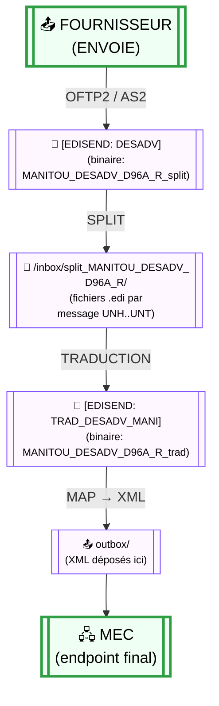

# MANITOU DESADV D96A R — README

<small>Version: package_install_rte_20251027 — Documentation</small>

---

## Table des matières

- [MANITOU DESADV D96A R — README](#manitou-desadv-d96a-r--readme)
  - [Table des matières](#table-des-matières)
  - [1) Résumé rapide](#1-résumé-rapide)
  - [2) Ce qui change (avant / après)](#2-ce-qui-change-avant--après)
  - [3) Nouveautés et pourquoi](#3-nouveautés-et-pourquoi)
  - [4) Comment ça fonctionne (schéma)](#4-comment-ça-fonctionne-schéma)
  - [5) Arborescence attendue (exemple)](#5-arborescence-attendue-exemple)
  - [6) Commandes (install / rollback)](#6-commandes-install--rollback)
  - [7) Que fait exactement `install` et `rollback`](#7-que-fait-exactement-install-et-rollback)
    - [7.a) `install_manitou_update_20251027.sh`](#7a-install_manitou_update_20251027sh)
    - [7.b) `rollback_manitou_update_20251027.sh`](#7b-rollback_manitou_update_20251027sh)
  - [8) Vérifications post-installation](#8-vérifications-post-installation)
  

---

## 1) Résumé rapide

- On a séparé le RTE monolithique en deux : un RTE split (découpe) et un RTE trad (traduction).
- But simple : rendre le traitement plus fiable et plus facile à gérer.

---

## 2) Ce qui change (avant / après)

- Avant : un seul RTE faisait tout.
- Maintenant :
  - `MANITOU_DESADV_D96A_R_split.rte` — fait le split (sortie : `/inbox/split_MANITOU_DESADV_D96A_R/`).
  - `MANITOU_DESADV_D96A_R.rte` — fait la traduction (lit le dossier split et écrit dans `outbox/`).

---

## 3) Nouveautés et pourquoi

- Séparation des tâches : split / trad.
- Moins de risques : une erreur touche seulement un message.
- Plus simple à tester et à corriger.

---

## 4) Comment ça fonctionne (schéma)

<a id="4-comment-ca-fonctionne-schema"></a>


```mermaid
flowchart TD
  %% Large blocks, vertical layout
  %% new palette + slightly larger fonts
  classDef bigBlock fill:#f0fff4,stroke:#2f9e44,stroke-width:3px,color:#000,font-size:18px;
  classDef stepBlock fill:#fff7ff,stroke:#7c4dff,stroke-width:1px,color:#000,font-size:12px;

  FOURNISSEUR[["📤 FOURNISSEUR<br/>(ENVOIE)<br/>"]]:::bigBlock
  EDISEND_SPLIT[["🔹 [EDISEND: DESADV]<br/>(binaire: <br/>MANITOU_DESADV_D96A_R_split)<br/>"]]:::stepBlock
  SPLIT_DIR[["📁 /inbox/split_MANITOU_DESADV_<br/>D96A_R/<br/>(fichiers .edi par <br/>message UNH..UNT)"]]:::stepBlock
  EDISEND_TRAD[["🔸 [EDISEND: TRAD_DESADV_MANI]<br/>(binaire: <br/>MANITOU_DESADV_D96A_R_trad)<br/>"]]:::stepBlock
  OUTBOX[["📤 outbox/<br/>(XML déposés ici)"]]:::stepBlock
  MEC[["🖧 MEC<br/>(endpoint final)"]]:::bigBlock

  FOURNISSEUR -->|OFTP2 / AS2| EDISEND_SPLIT
  EDISEND_SPLIT -->|SPLIT| SPLIT_DIR
  SPLIT_DIR -->|TRADUCTION| EDISEND_TRAD
  EDISEND_TRAD -->|MAP → XML| OUTBOX
  OUTBOX --> MEC
```

---

## 5) Arborescence attendue (exemple)

```
edidev/
├── rte/
│   ├── ARCHIVE/                          # archives des anciens RTE
│   ├── MANITOU_DESADV_D96A_R_split.rte   # split
│   └── MANITOU_DESADV_D96A_R.rte         # trad
├── inbox/
│   ├── edifact/                          # interchanges entrants
│   └── split_MANITOU_DESADV_D96A_R/      # sorties du splitter (.edi)
└── outbox/                               # XML générés
└── package_install_rte_20251027/         # paquet d'installation (scripts + dumps)
```

---

## 6) Commandes (install / rollback)

Exécutez ces commandes depuis le dossier du paquet (`package_install_rte_20251027`) :

Installer :

```bash
cd /chemin/vers/package_install_rte_20251027
./install_manitou_update_20251027.sh
```

Rollback :

```bash
cd /chemin/vers/package_install_rte_20251027
./rollback_manitou_update_20251027.sh
```

---

## 7) Que fait exactement `install` et `rollback`

### 7.a) `install_manitou_update_20251027.sh`

1. Sauvegarde le routing DESADV.
2. Modifie le routing DESADV pour utiliser le RTE split `TRANSLATOR=MANITOU_DESADV_D96A_R_split` (édition directe du fichier de contrôle).
3. Copie les nouveaux RTE dans `rte/` et archive l'ancien dans `rte/ARCHIVE/`.
4. Importe le dump edisend `TRAD_DESADV_MANI` fourni dans le paquet d'installation.
5. Compile les RTE si l'outil `mktr` est disponible.

### 7.b) `rollback_manitou_update_20251027.sh`

1. Supprime les RTE installés (split + trad).
2. Supprime l'entrée edisend `TRAD_DESADV_MANI` si elle existe.
3. Remet `TRANSLATOR=MANITOU_DESADV_D96A_R` du routing sur `MANITOU_DESADV_D96A_R` (édition directe du fichier de contrôle).
4. Restaure la dernière archive RTE trouvée dans `rte/ARCHIVE/`.
5. IMPORTANT : rollback NE restaure PAS automatiquement les dumps ; toute réimportation reste manuelle.

---

## 8) Vérifications post-installation

1. Déposez un interchange EDIFACT de test dans `inbox/edifact/`.
2. Vérifiez que `inbox/split_MANITOU_DESADV_D96A_R/` contient un fichier `.edi` par message.
3. Vérifiez que `outbox/` reçoit les XML produits.
4. Regarder les logs au besoin

---
